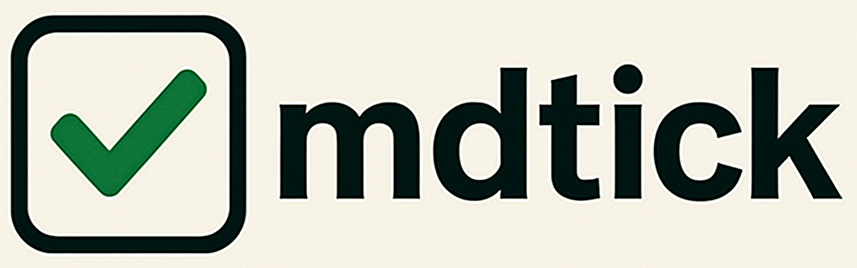

# mdtick

**mdtick** is a lightweight CLI tool that visualizes progress across multiple Markdown checklists. It reads your `.md` files and shows a dashboard of completed vs total tasks.

---

## 🔧 Features

- Parses markdown checkboxes (`- [ ]`, `- [x]`)
- Displays project status as:
  - Animated progress bars (default)
  - Static table view (`--view table`)
- Clean terminal UI using [Rich](https://github.com/Textualize/rich)

---

> Work in progress!
